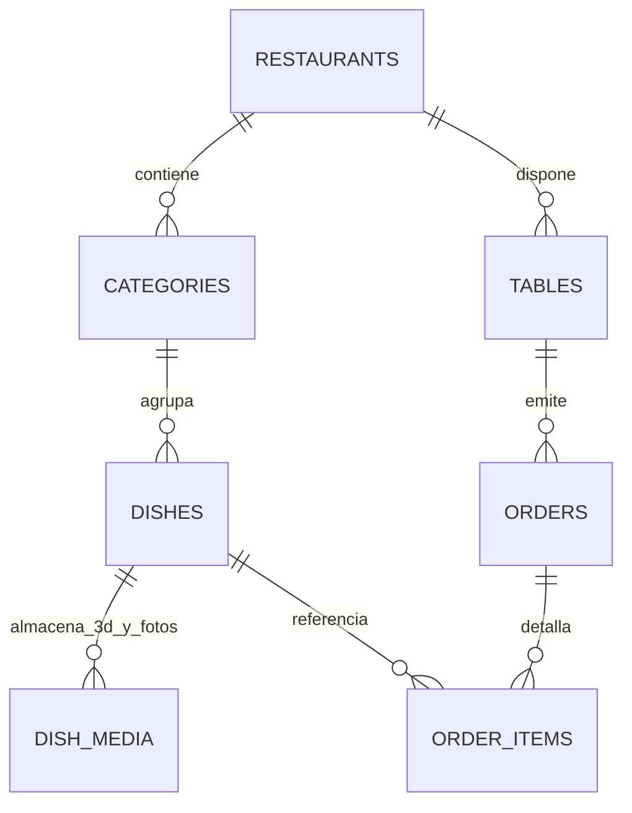

# Aura Gastronomique — Visión Final, Arquitectura & Stack Tecnológico

> **Manifiesto de Ingeniería, Hoja de Ruta de Producto & Ecosistema de Herramientas**  
> *Especificación de lo que el proyecto debe ser en su estado maduro definitivo y el ecosistema técnico implementado.*

---

## 1. Visión Holística del Producto Final

Aura Gastronomique no es un simple menú digital en PDF ni un catálogo estático; es una **plataforma integral de experiencia culinaria y comanda unificada multi-inquilino (White-Label)** orientada a la alta cocina internacional, restaurantes con estrellas Michelin y bistrós de vanguardia.

### Pilares de la Experiencia Final:
1. **Fricción Cero en Mesa (Web PWA Sin Descargas):** El comensal escanea un código QR en la mesa física y accede en menos de 1.2 segundos sin descargar ninguna app de la App Store o Google Play.
2. **WebAR 1:1 Hiperrealista:** El comensal puede proyectar el plato en su tamaño físico real sobre el mantel para apreciar la escala de la porción, la vajilla y la composición antes de ordenar, reduciendo la incertidumbre y elevando el ticket promedio.
3. **Ficha Sensorial Integral:** Información de origen de los ingredientes, notas de cata y maridaje del sommelier.
4. **Comanda Sincronizada en Tiempo Real (Mesa → Pase de Cocina):** Cuando los comensales de una mesa envían su orden, esta se consolida en un dashboard de cocina (*Kitchen Display System - KDS*) mediante WebSockets / Supabase Realtime.
5. **Backoffice y Analítica para el Chef / Gerente:** Métricas exactas de cuántas veces se visualizó cada plato en 3D, tiempo de permanencia, embudo de conversión a pedido y gestión de inventario/agotados en caliente.

---

## 2. Ecosistema de Herramientas y Stack Tecnológico (Tools & Libraries)

| Capa / Dominio | Herramienta / Tecnología | Propósito y Función en el Proyecto |
| :--- | :--- | :--- |
| **Framework Base** | **Next.js 16 (Turbopack + App Router)** | Arquitectura moderna con Server Components y renderizado híbrido estático/dinámico. |
| **Biblioteca de UI** | **React 19 + TypeScript 5** | Tipado estricto de datos de menú, componentes atómicos e interfaces reactivas. |
| **Estilos & Diseño** | **Tailwind CSS v4** | Motor de estilos de alto rendimiento basado en Rust con variables CSS nativas y soporte de *Dark-First Gourmet*. |
| **Motion & Micro-interacciones** | **GSAP (GreenSock) + Framer Motion** | Orquestación de líneas de tiempo para transiciones cinemáticas de entrada, física `power3.out` y animaciones táctiles. |
| **Generación Visual de Fondos** | **Haikei ([haikei.app](https://haikei.app/))** | Generación de texturas vectoriales SVG multicapa orgánicas y dunas topográficas de bajo peso para evitar fondos negros planos. |
| **Motor 3D & Realidad Aumentada** | **`@google/model-viewer` v4** | Motor WebGL/WebXR que abstrae de forma nativa la proyección AR para Apple QuickLook (`.usdz` en iOS) y SceneViewer (`.glb` en Android). |
| **Diseño y Shaders 3D** | **Spline ([spline.design](https://spline.design/))** | Herramienta de modelado y exportación de archivos `.glb` optimizados para la vajilla de los restaurantes. |
| **Estado Global y Persistencia** | **Zustand 5 (con middleware `persist`)** | Manejo de estado del carrito/comanda, filtros de carta y persistencia en `localStorage` ante desconexiones. |
| **Base de Datos & Backend** | **Supabase (PostgreSQL 15 + RLS)** | Almacenamiento relacional de restaurantes, perfiles, cartas, fotos, modelos 3D y comandas en tiempo real. |
| **Storage Multimedia** | **Supabase Storage (`menu-media`)** | CDN para servir modelos pesados (`.glb`, `.usdz`), pósters WebP y fotografías culinarias con compresión. |
| **Despliegue & CI/CD** | **Netlify + GitHub** | Hosting global en Edge CDN, headers de seguridad WebAR, soporte HTTPS obligatorio para cámara y despliegue automático desde `master`. |
| **Iconografía Técnica** | **Lucide React** | Iconografía vectorizada minimalista y sin emojis (*anti-slop*). |

---

## 3. Arquitectura del Backend Relacional (Supabase PostgreSQL)

El backend en `supabase/migrations/01_initial_schema.sql` y `docs/supabase_schema.sql` cuenta con la siguiente arquitectura:

### Tablas Implementadas:
1. **`profiles`:** Usuarios con control de acceso basado en roles (`superadmin`, `owner`, `manager`, `chef`, `waiter`).
2. **`restaurants`:** Configuración del local, moneda (`€`, `$`), nombre y colores de acento (soporte multi-inquilino).
3. **`categories`:** Entrantes, Principales, Postres, Vinos, etc.
4. **`dishes`:** Platos con gramaje, tiempo de preparación, alérgenos y maridajes de sommelier.
5. **`dish_media`:** Soporte polimórfico para `.glb` (Android), `.usdz` (iOS QuickLook) y fotografías WebP.
6. **`tables`:** Asignación de mesas físicas (`Mesa 14`, `Terraza 02`) asociadas a códigos QR únicos.
7. **`orders` & `order_items`:** Registro de tickets de comanda con estado en tiempo real (`pending`, `in_preparation`, `delivered`, `closed`) y notas personalizadas del cliente.

---

## 4. Hoja de Ruta (Roadmap) hacia la Versión Final Definitiva

### Fase 1: Perfeccionamiento de la Experiencia Móvil & Visual (Completada ✅)
- [x] Landing de bienvenida cinemática con ondas orgánicas Haikei y GSAP.
- [x] Eliminación de textos intrusivos ("WebAR 1:1 inmersivo" y "AR Ready").
- [x] Flujo "Fotografía Primero" y activación de 3D/360° bajo demanda.
- [x] Fijación de modelo en mesa con `ar-placement="floor"` y `ar-scale="fixed"`.
- [x] Despliegue en producción con HTTPS en Netlify.

### Fase 2: Conexión Activa de Supabase en Tiempo Real (Siguiente Paso)
- [ ] Vincular variables de entorno `NEXT_PUBLIC_SUPABASE_URL` y `NEXT_PUBLIC_SUPABASE_ANON_KEY`.
- [ ] Migrar el almacén de datos de `menuData.ts` para que cargue los platos dinámicamente desde la tabla `dishes` de Supabase.
- [ ] Conectar el botón de "Confirmar Comanda" para que inserte la orden en las tablas `orders` y `order_items`.

### Fase 3: Kitchen Display System (KDS) & Panel de Sala
- [ ] Vista `/kitchen` para la pantalla de cocina, donde las órdenes ingresadas por los comensales aparezcan en tiempo real mediante `supabase.channel('public:orders')`.
- [ ] Cambio de estado del plato (En preparación -> Listo para servir) que notifique al camarero.

### Fase 4: Integración de Modelos 3D de Alta Fidelidad en Spline
- [ ] Modelado o fotogrametría de la vajilla y platos de la carta en Spline.
- [ ] Exportación de archivos gemelos (`.glb` optimizado a < 4MB para Android y `.usdz` para iOS).
- [ ] Alojamiento en el bucket `menu-media` con cabeceras de caché inmutables.
