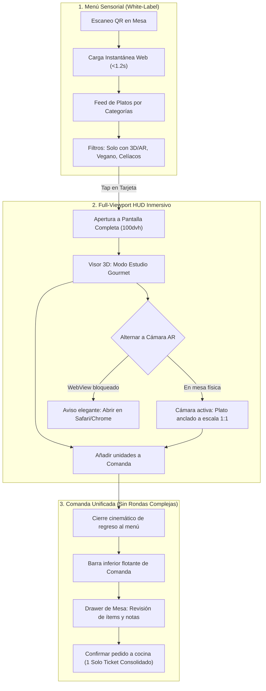

# Especificación de Producto Definitiva: Aura Gastronomique

> **Plataforma WebAR & Menú Interactivo de Alta Gastronomía (White-Label)**  
> **Documento Consolidado de Arquitectura UX, Ingeniería de Rendimiento & Flujos de Usuario**

---

## 1. Veredicto del Stack Técnico & Arquitectura de Rendimiento

Tras el análisis exhaustivo de arquitectura frente a soluciones de líderes mundiales (Shopify 3D, Apple Quick Look, IKEA Kreativ y Lusion):

| Capa                  | Elección Definitiva                                    | Justificación Técnica & Ventaja Competitiva                                                                                                                                                                                                                                                         |
| :-------------------- | :----------------------------------------------------- | :-------------------------------------------------------------------------------------------------------------------------------------------------------------------------------------------------------------------------------------------------------------------------------------------------- |
| **Framework**         | **Next.js 16 (App Router) + React 19 + TypeScript 5**  | Máxima demanda en el mercado profesional. Para evitar fallos de rutas en Windows con Turbopack, los assets 3D se sirven como recursos estáticos directos desde `/public/models/food/` o CDN externa.                                                                                                |
| **Motor 3D & WebAR**  | **`@google/model-viewer` (Abstracción WebGL + WebXR)** | Es el estándar de oro en comercio electrónico WebAR: incluye detección automática de **Apple Quick Look (iOS Safari)** y **Scene Viewer / WebXR (Android)** en una sola línea. Permite _double-poster_ WebP progresivo y sombreado ACESFilmic fotorrealista sin sobrecargar el hilo de renderizado. |
| **Gestión de Estado** | **Zustand con middleware `persist`**                   | Evita los re-renders masivos de React Context que destruyen la tasa de 60/120 FPS del canvas 3D. Mantiene la comanda persistente en `localStorage` si el comensal refresca o cambia de app.                                                                                                         |
| **Diseño & Motion**   | **Tailwind CSS v4 + Framer Motion 13 + CVA**           | Variables CSS nativas ultra-rápidas en Rust. Patrón _Dark Gourmet Minimalist_ con micro-interacciones tipo spring (física real) y glassmorphism calibrado para restaurantes con luz tenue.                                                                                                          |

### Claves de Rendimiento Móvil Crítico (< 1.2s LCP)

1. **La técnica del "Double Poster":** El primer elemento cargado nunca es el 3D pesado, sino un póster WebP ultraligero (< 25KB) servido con `fetchpriority="high"`. El modelo 3D GLB solo se descarga e inicializa cuando el comensal solicita interactuar.
2. **Gestión Estricta de Memoria GPU (Prevención de Crashes en Safari iOS):** Safari en iPhone cierra pestañas si se superan múltiples contextos WebGL o más de 250MB de VRAM. La app implementa un **Singleton de Contexto WebGL** que desmonta y purga texturas de memoria al salir del modo inmersivo.
3. **Manejo de In-App Browsers (Instagram/TikTok/WhatsApp):** Detección proactiva de navegadores embebidos que bloquean la cámara AR. Si se detecta, se muestra un banner sutil guiando a abrir en Safari/Chrome, manteniendo el visor 360° disponible sin fallos.

---

## 2. Experiencia de Usuario: Full-Viewport Viewport HUD (Mobile-First)

A diferencia de un modal convencional que aprisiona la comida en una ventana pequeña, la experiencia adopta el patrón **Full-Viewport 3D/AR a Pantalla Completa (`100dvh`)**:

```
+-------------------------------------------------------------+
| [ ✕ ]      [ 360° Estudio  |  Cámara AR ]       [ Escala 1:1 ] | <- Top Glassmorphism Bar
|                                                             |
|                                                             |
|                                                             |
|                      CANVAS 3D / AR                         |
|                 (Plato Fotorrealista en                     |
|                   el Centro de la Mesa)                     |
|                                                             |
|                                         [ ⟲ Recenter ]      | <- Floating Side Controls
|                                                             |
|                                                             |
| +---------------------------------------------------------+ |
| | Wagyu A5 con Reducción de Oporto              48.00 €   | |
| | Microbrotes, trufa negra de Alba                        | |
| | [ - ]  1  [ + ]       [  + AÑADIR A LA COMANDA  ]       | | <- Bottom Floating Glass Bar
| +---------------------------------------------------------+ |
+-------------------------------------------------------------+
```

### Elementos del HUD Inmersivo:

1. **Top Bar Flotante (Glassmorphism sutil `backdrop-blur-md`):**
   - **Botón Salir (`✕`):** Zona táctil ergonómica de 44×44px con respuesta háptica.
   - **Pill Selector Háptico:**
     - `360° Estudio`: Fondo carbón gourmet profundo (`#0D0F12`) con iluminación radial cenital cálida y sombra de contacto.
     - `Cámara AR`: Activa la cámara en vivo proyectando el plato sobre el mantel o madera de la mesa física.
   - **Badge de Escala:** Indica si el comensal está viendo la porción a escala real (1:1).
2. **Controles Laterales Rápidos:** Botón discreto para recentrar el plato o reiniciar la rotación automática en mesa.
3. **Bottom Bar Flotante (Ergonomía en el pulgar / Thumb Zone):**
   - No tapa el plato gracias a un degradado translúcido (_adaptive scrim_).
   - Selector de unidades `[-] 1 [+]`, desglose de precio y botón CTA con micro-animación hacia el icono de comanda.

---

## 3. Flujograma General y Comanda Unificada



---

## 4. Arquitectura Atómica del Sistema (Atomic Design Structure)

Estructura física de carpetas y componentes:

```
src/
├── components/
│   ├── atoms/                  # Elementos indivisibles y reutilizables
│   │   ├── Badge.tsx           # Tags dietéticos (Vegano, Gluten-Free) y Escala 1:1
│   │   ├── Button.tsx          # Botones primarios, iconos y selector háptico
│   │   ├── PriceTag.tsx        # Formateador de moneda dinámico
│   │   └── ScrimOverlay.tsx    # Gradiente translúcido anti-oclusión
│   │
│   ├── molecules/              # Combinaciones de átomos con propósito único
│   │   ├── CategoryPill.tsx    # Filtros de categoría con estado activo
│   │   ├── QuantityPicker.tsx  # Selector táctil [-] 1 [+]
│   │   ├── ModeSwitch.tsx      # Switch deslizable: [ Estudio 360° | Cámara AR ]
│   │   └── FilterGroup.tsx     # Barra de filtros rápidos (3D, Veggie, Chef)
│   │
│   ├── organisms/              # Estructuras complejas e interactivas
│   │   ├── DishCard.tsx        # Tarjeta del plato en el feed principal
│   │   ├── FullViewportViewer/ # Canvas 100dvh con HUD flotante y controles AR
│   │   ├── CartDrawer.tsx      # Drawer gestual para revisión de la orden
│   │   ├── HeaderNavbar.tsx    # Identidad del restaurante y número de mesa
│   │   └── AdminInventoryTable/# Tabla de gestión y analítica de platos
│   │
│   └── templates/              # Layouts agnósticos para inyección de datos
│       ├── MenuTemplate.tsx    # Plantilla de cliente con feed, navbar y comanda
│       └── AdminTemplate.tsx   # Plantilla de administración y KPIs
│
├── store/                      # Estado global con Zustand
│   └── useComandaStore.ts      # Carrito, mesa, notas y control de instancia WebGL
│
├── data/                       # Esquemas tipados y datos mock agnósticos
│   └── menuSchema.ts           # Interfaz White-Label (compatible con cualquier cocina)
```
