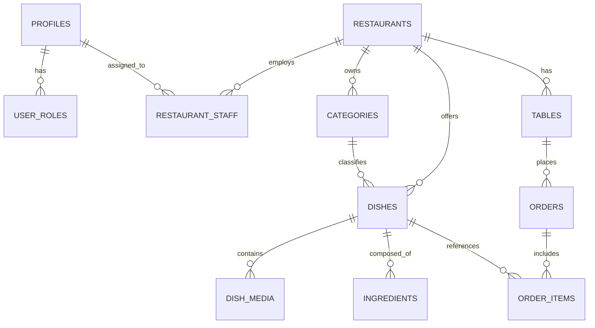

# Plan de Arquitectura: Backend, Base de Datos Supabase, Storage Multimedia y Autenticación RBAC

Este documento establece el diseño técnico, el modelo relacional de datos en PostgreSQL (Supabase), la gestión de assets multimedia enriquecidos y la estrategia de autenticación y despliegue del backend en **Netlify** para **Aura Gastronomique**.

---

## 1. Modelo de Datos Relacional (PostgreSQL en Supabase)

### A. Extensiones de Postgres
- `uuid-ossp` o `pgcrypto` para generación de IDs (`gen_random_uuid()`).
- `citext` para emails case-insensitive.

### B. Esquema de Tablas

#### 1. `profiles` (Usuarios y Staff)
Mapeada directamente con `auth.users` de Supabase:
- `id`: `uuid PRIMARY KEY REFERENCES auth.users(id) ON DELETE CASCADE`
- `email`: `text NOT NULL`
- `full_name`: `text`
- `avatar_url`: `text`
- `role`: `text NOT NULL CHECK (role IN ('superadmin', 'owner', 'manager', 'chef', 'waiter'))`
- `created_at`: `timestamptz DEFAULT now()`
- `updated_at`: `timestamptz DEFAULT now()`

#### 2. `restaurants` (Multi-tenant White-Label)
- `id`: `uuid PRIMARY KEY DEFAULT gen_random_uuid()`
- `slug`: `text UNIQUE NOT NULL` (ej. `aura-madrid`)
- `name`: `text NOT NULL`
- `tagline`: `text`
- `currency_symbol`: `text DEFAULT '€'`
- `primary_accent`: `text DEFAULT '#E5C378'`
- `is_active`: `boolean DEFAULT true`
- `created_at`: `timestamptz DEFAULT now()`

#### 3. `restaurant_staff` (Asignación de roles por local)
- `id`: `uuid PRIMARY KEY DEFAULT gen_random_uuid()`
- `restaurant_id`: `uuid REFERENCES restaurants(id) ON DELETE CASCADE`
- `profile_id`: `uuid REFERENCES profiles(id) ON DELETE CASCADE`
- `role`: `text NOT NULL CHECK (role IN ('owner', 'manager', 'chef', 'waiter'))`
- `is_active`: `boolean DEFAULT true`
- `created_at`: `timestamptz DEFAULT now()`
- `UNIQUE(restaurant_id, profile_id)`

#### 4. `categories` (Categorías del Menú)
- `id`: `text PRIMARY KEY` (ej: `entrantes`, `principales`, `postres`, `bebidas`)
- `restaurant_id`: `uuid REFERENCES restaurants(id) ON DELETE CASCADE`
- `label`: `text NOT NULL`
- `display_order`: `int NOT NULL DEFAULT 0`
- `is_active`: `boolean DEFAULT true`

#### 5. `dishes` (Platos y Creaciones Culinarias)
- `id`: `text PRIMARY KEY` (ej: `wagyu-a5`, `caviar-imperial`)
- `restaurant_id`: `uuid REFERENCES restaurants(id) ON DELETE CASCADE`
- `category_id`: `text REFERENCES categories(id)`
- `name`: `text NOT NULL`
- `tagline`: `text`
- `description`: `text`
- `price`: `numeric(10, 2) NOT NULL CHECK (price >= 0)`
- `portion_weight`: `text` (ej: `180g`, `350ml`)
- `prep_time_minutes`: `int DEFAULT 15`
- `sommelier_pairing`: `text` (notas de vino/cata)
- `origin_story`: `text` (storytelling y origen noble)
- `dietary_flags`: `jsonb DEFAULT '{}'::jsonb` (ej: `{"vegetarian": false, "vegan": false, "glutenFree": true, "chefSpecial": true}`)
- `ingredients`: `text[] DEFAULT '{}'`
- `is_available`: `boolean DEFAULT true`
- `views_3d_count`: `int DEFAULT 0`
- `orders_count`: `int DEFAULT 0`
- `created_at`: `timestamptz DEFAULT now()`
- `updated_at`: `timestamptz DEFAULT now()`

#### 6. `dish_media` (Almacenamiento Multimedia Polimórfico)
Especialmente diseñada para soportar **Foto, Video, GIF, Modelos 3D (GLB) y USDZ (iOS AR)**:
- `id`: `uuid PRIMARY KEY DEFAULT gen_random_uuid()`
- `dish_id`: `text REFERENCES dishes(id) ON DELETE CASCADE`
- `media_type`: `text NOT NULL CHECK (media_type IN ('image', 'video', 'gif', 'model3d_glb', 'model3d_usdz', 'poster'))`
- `url`: `text NOT NULL`
- `thumbnail_url`: `text`
- `aspect_ratio`: `text DEFAULT '16:9'`
- `file_size_bytes`: `bigint`
- `is_primary`: `boolean DEFAULT false`
- `display_order`: `int DEFAULT 0`
- `metadata`: `jsonb DEFAULT '{}'::jsonb` (ej: `{ "draco_compressed": true, "lod": "high", "ar_scale": "fixed" }`)
- `created_at`: `timestamptz DEFAULT now()`

#### 7. `tables` (Mesas del Restaurante)
- `id`: `uuid PRIMARY KEY DEFAULT gen_random_uuid()`
- `restaurant_id`: `uuid REFERENCES restaurants(id) ON DELETE CASCADE`
- `table_number`: `text NOT NULL` (ej. `Mesa 14`, `Terraza 2`)
- `qr_code_token`: `text UNIQUE DEFAULT gen_random_uuid()::text`
- `is_occupied`: `boolean DEFAULT false`

#### 8. `orders` (Comandas Consolidadas de Mesa)
- `id`: `uuid PRIMARY KEY DEFAULT gen_random_uuid()`
- `restaurant_id`: `uuid REFERENCES restaurants(id) ON DELETE CASCADE`
- `table_id`: `uuid REFERENCES tables(id) ON DELETE SET NULL`
- `table_number`: `text NOT NULL`
- `status`: `text NOT NULL CHECK (status IN ('received', 'in_kitchen', 'served', 'paid', 'cancelled')) DEFAULT 'received'`
- `total_amount`: `numeric(10, 2) NOT NULL DEFAULT 0.00`
- `notes`: `text`
- `created_at`: `timestamptz DEFAULT now()`
- `updated_at`: `timestamptz DEFAULT now()`

#### 9. `order_items` (Detalle de cada plato en la comanda)
- `id`: `uuid PRIMARY KEY DEFAULT gen_random_uuid()`
- `order_id`: `uuid REFERENCES orders(id) ON DELETE CASCADE`
- `dish_id`: `text REFERENCES dishes(id)`
- `dish_name`: `text NOT NULL`
- `unit_price`: `numeric(10, 2) NOT NULL`
- `quantity`: `int NOT NULL CHECK (quantity > 0)`
- `special_notes`: `text`
- `created_at`: `timestamptz DEFAULT now()`

---

## 2. Supabase Storage: Buckets y Políticas de Multimedia

Para servir fotos, videos y modelos 3D con máxima velocidad y optimización en caché:

1. **Bucket `menu-media` (Público para lectura)**:
   - `/images/`: WebP y AVIF para fotos de platos y posters de precarga.
   - `/videos/`: MP4 (H.264/H.265) y WebM ligeros para fondos o texturas en bucle.
   - `/gifs/`: Animaciones breves de elaboración culinaria.
   - `/models-3d/`:
     * Archivos `.glb` optimizados con Draco / Meshopt compression.
     * Archivos `.usdz` para QuickLook nativo en iPhone/iPad.
2. **Políticas de Storage RLS**:
   - **Lectura**: Acceso público (`anon`) a todos los archivos.
   - **Escritura/Subida/Borrado**: Restringido a usuarios autenticados con rol `owner`, `manager` o `chef` asociados al restaurante.

---

## 3. Seguridad y Row Level Security (RLS) en Supabase

- **`dishes`, `categories`, `dish_media`**:
  - `SELECT`: Público (`anon` y `authenticated`).
  - `INSERT / UPDATE / DELETE`: Solo usuarios autenticados cuyo perfil tenga rol de administrador (`owner`, `manager`, `chef`).
- **`orders`, `order_items`**:
  - `INSERT`: Público (`anon`) para que el cliente desde la mesa pueda emitir su comanda sin login obligatorio.
  - `SELECT`: Clientes pueden leer su propia orden activa mediante token de mesa; el staff del restaurante puede ver todas las órdenes activas en tiempo real vía Supabase Realtime.
  - `UPDATE`: Solo staff del restaurante (para cambiar estado a `in_kitchen`, `served`, `paid`).

---

## 4. Arquitectura del Backend & Despliegue en Netlify

El backend operará aprovechando la arquitectura híbrida de **Next.js + Netlify + Supabase**:

1. **Next.js App Router API Routes (`/api/v1/...`)**:
   - `/api/v1/menu`: Endpoint público con caching HTTP (`Cache-Control: s-maxage=60, stale-while-revalidate=300`).
   - `/api/v1/comandas`: Recepción y validación de comandas consolidadas.
   - `/api/v1/admin/analytics`: Métricas de vistas 3D/AR, tasas de conversión y platos más solicitados.
   - `/api/v1/admin/upload-media`: Generación de presigned URLs para subir modelos 3D y videos directamente a Supabase Storage sin saturar el serverless.
2. **Supabase Realtime**:
   - Suscripción WebSocket en el terminal de cocina y administración (`AdminTemplate`) para recibir nuevas comandas de forma instantánea sin refrescar la página.
3. **Despliegue en Netlify**:
   - Conexión del repositorio Git mediante **Netlify Plugin / Next.js Runtime (`@netlify/plugin-nextjs`)**.
   - Variables de entorno seguras en Netlify (`NEXT_PUBLIC_SUPABASE_URL`, `NEXT_PUBLIC_SUPABASE_ANON_KEY`, `SUPABASE_SERVICE_ROLE_KEY`).
   - Soporte para Netlify Edge Functions y compresión automática Brotli/Gzip para entrega ultrarrápida en móviles.

---

## 5. Próximos Pasos para Ejecución

1. **Revisión del Plan**: ¿Deseas agregar o ajustar algún campo particular (ej. desglose de IVA/impuestos, múltiples idiomas o sistema de pagos en mesa con Stripe/Datafono)?
2. **Creación del Script SQL de Migración**: Generar el script SQL idempotente listo para ejecutar en Supabase SQL Editor.
3. **Instalación de Cliente Supabase**: Configurar `@supabase/supabase-js` y `@supabase/ssr` en el proyecto Next.js.
4. **Setup en Netlify**: Configurar `netlify.toml` con cabeceras de seguridad CSP y compresión para modelos `.glb`.
