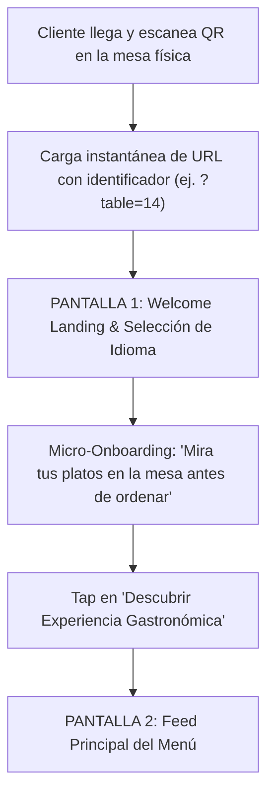
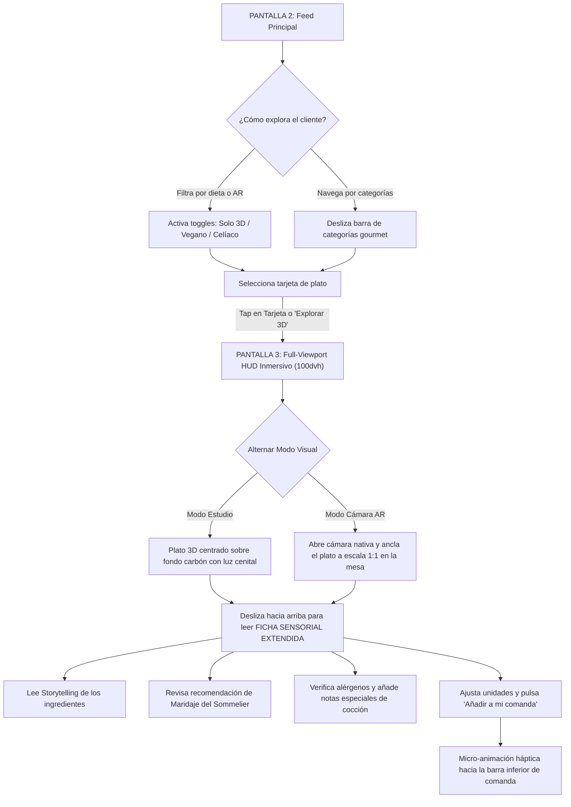
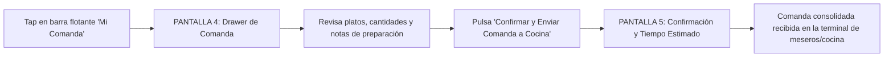

# Especificación Conceptual & Arquitectura UX: Menú Comensal 3D / Realidad Aumentada (AR)
> **Fuente de Verdad (Single Source of Truth) para Look & Feel, Flujos y Experiencia Comensal**  
> **Proyecto:** Aura Gastronomique (Plataforma WebAR White-Label para Restaurantes de Alta Gama)

---

## 1. Filosofía de Producto & Enfoque 100% White-Label

Aura Gastronomique no está atada a ninguna cocina en particular: es una **plataforma agnóstica de alta costura digital** adaptable de inmediato a:
- Asadores y parrillas de cortes madurados.
- Alta cocina japonesa / barras Omakase y Nikkei.
- Cocina mediterránea de autor y marisquerías de lonja.
- Bistrós contemporáneos y alta repostería.

### Los 4 Pilares Inquebrantables de la Experiencia:
1. **Cero Fricción (WebAR Instantáneo):** Sin apps de App Store / Play Store. Se accede escaneando un código QR en mesa y abre en menos de 1.5s en cualquier navegador móvil (Safari en iOS, Chrome en Android).
2. **Atmósfera Dark Gourmet & Anti-Slop:** Fondos en negro obsidiana profundo (`#08090A`), acentos en oro champán mate (`#E5C378`), superficies de vidrio ahumado (*glassmorphism* `backdrop-blur: 24px`) y tipografía serif editorial de alta costura (*Cormorant Garamond* / *Playfair Display*).
3. **Escala 1:1 Fotorrealista:** El 3D y la Realidad Aumentada resuelven la incertidumbre de la porción real, el diámetro de la vajilla y la textura de los alimentos antes de ordenar.
4. **Ficha Sensorial & Storytelling del Sommelier:** Cada creación culinaria se acompaña de su historia de origen, notas del chef, maridaje recomendado y desglose de alérgenos transparente.

---

## 2. Mapa Completo de Vistas & Pantallas de la Experiencia Comensal

```
[ PANTALLA 1: Welcome Screen & Onboarding de Mesa ]
   ├── Monograma / Logo del Restaurante (White-Label)
   ├── Identificador de Mesa Táctil (Ej. "Mesa 14 • Salón Principal")
   ├── Selector Rápido de Idioma (ES / EN / IT / FR)
   ├── Micro-Onboarding Visual:
   │     1. "Explora el menú sensorial"
   │     2. "Proyecta los platos en tu mesa con Realidad Aumentada"
   │     3. "Envía tu comanda directamente al equipo de cocina"
   └── Botón de Entrada Principal: "Descubrir Experiencia Gastronómica"
       │
       ▼
[ PANTALLA 2: Feed Principal del Menú Móvil ]
   ├── Top Bar Flotante: Branding, Mesa activa, Selector de idioma y Carrito
   ├── Hero Sensorial: "El arte de la gastronomía en tres dimensiones"
   ├── Barra Horizontal de Categorías (Pills en cristal esmerilado):
   │     ├── Entrantes & Degustación
   │     ├── Platos Fuertes & Fuego
   │     ├── Del Mar & Crudos
   │     ├── Huerto & Vegetariano
   │     ├── Dulces & Repostería
   │     └── Bodega, Cava & Coctelería de Autor
   ├── Filtros Rápidos Semánticos:
   │     ├── 🔮 "Solo con 3D / AR" (para filtrar platos proyectables)
   │     ├── 🌱 "Plant-Based / Veggie"
   │     ├── 🌾 "Sin Gluten (Celíacos)"
   │     └── ⭐ "Firma del Chef / Recomendados"
   ├── Feed de Tarjetas Gastronómicas Asimétricas:
   │     ├── Fotografía cenital fotorrealista + Badges flotantes (3D, tiempo, porción)
   │     ├── Nombre del plato en serif editorial + Tagline sensorial
   │     ├── Precio formateado en oro champán
   │     └── Acciones: "Explorar en 3D" (abre pantalla 3) y Botón "+" rápido
   └── Cápsula Flotante Inferior de Comanda:
         └── Muestra ítems seleccionados, subtotal acumulado y acceso al Drawer
       │
       ▼
[ PANTALLA 3: Visor Inmersivo Full-Viewport HUD (100dvh) & Ficha Sensorial ]
   ├── MODO VISUAL INMERSIVO A PANTALLA COMPLETA:
   │     ├── Canvas 3D (Modo Estudio con sombra de contacto y luz radial)
   │     ├── Stream de Cámara AR (Plato anclado 1:1 sobre mantel de la mesa física)
   │     ├── Top HUD Bar:
   │     │     ├── Botón de Cierre Minimal ('✕' ergonómico 44x44px)
   │     │     ├── Segmented Pill: [ 360° Estudio ] | [ Cámara AR en Mesa ]
   │     │     └── Badge de Fidelidad: "Escala 1:1 Real • 320g"
   │     └── Guía Táctil: "Gira con un dedo • Pellizca para zoom" + Botón Recenter ('⟲')
   │
   └── FICHA SENSORIAL EXTENDIDA (Deslizable desde la base):
         ├── Identidad: Nombre del plato, precio y peso de porción
         ├── Storytelling & Origen:
         │     └── Párrafo curado sobre el origen noble de los ingredientes y técnica culinaria
         ├── Maridaje del Sommelier (Pairing Box):
         │     └── Icono de copa + Vino/Champagne/Cóctel sugerido con notas de cata
         ├── Desglose de Alérgenos & Transparencia:
         │     └── Chips con micro-iconos (Gluten, Lácteos, Frutos secos, Crustáceos)
         ├── Notas Especiales para Cocina:
         │     └── Campo de texto minimalista: "Término de cocción, intolerancias..."
         └── Barra de Acción Thumb-Zone:
               ├── Selector de Unidades: [-] 1 [+]
               └── Botón Primario: "Añadir a mi comanda • [Precio Total]"
       │
       ▼
[ PANTALLA 4: Drawer de Comanda Unificada (Ticket Consolidado) ]
   ├── Header: "Comanda de Mesa 14" • Estado: "Borrador de Mesa"
   ├── Lista de Platos con Miniaturas, Cantidades y Notas particulares del cliente
   ├── Desglose Financiero: Subtotal, Impuestos, Sugerencia de Servicio
   └── Botón de Confirmación Háptica: "Confirmar y Enviar Comanda a Cocina"
       │
       ▼
[ PANTALLA 5: Estado de Comanda Enviada (Live Kitchen Status) ]
   ├── Animación sutil de confirmación
   ├── Indicador de estado: "Comanda recibida en cocina • Mesa 14"
   ├── Tiempo estimado de servicio (ej. 15-20 min)
   └── Botón secundario: "Seguir explorando el menú / Añadir maridaje o postres"
```

---

## 3. Flujogramas Detallados de Experiencia de Usuario (User Flows)

### Flujo 1: Onboarding, Escaneo y Entrada a Mesa



### Flujo 2: Exploración, Visor 3D Full-Viewport & Ficha Sensorial



### Flujo 3: Consolidación y Envío de la Comanda Unificada



---

## 4. Matriz de Componentes bajo Arquitectura Atómica

| Nivel | Componentes Específicos | Responsabilidad |
| :--- | :--- | :--- |
| **Átomos** | `Badge` (3D/AR, Chef, Veggie, Escala 1:1, Alérgenos), `PriceTag`, `Button` (Primary, Secondary, Glass, Icon), `ScrimOverlay`, `LanguageToggle`, `NotesInput` | Elementos puros de renderizado sin lógica de negocio |
| **Moléculas** | `CategoryPill`, `QuantityPicker`, `ModeSwitch` (360° vs AR), `PairingCard` (maridaje de vino), `AllergenRow`, `TableStatusBar` | Agrupaciones cohesivas con eventos táctiles y estado local |
| **Organismos** | `DishCard`, `FullViewportViewer` (Canvas 100dvh + HUD flotante), `SensoryDetailSheet` (Storytelling + Maridaje), `CartDrawer` (Comanda), `WelcomeHeroModal` | Módulos funcionales de alta complejidad |
| **Plantillas** | `WelcomeTemplate`, `MenuTemplate`, `ViewerTemplate`, `OrderStatusTemplate` | Esquema estructural de layout desacoplado de datos |
| **Vistas** | `ClientAppContainer` | Inyección de estado global con Zustand (`useComandaStore`) |
